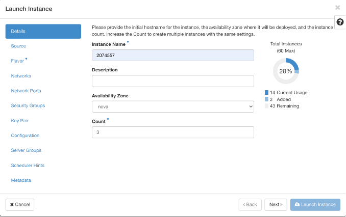
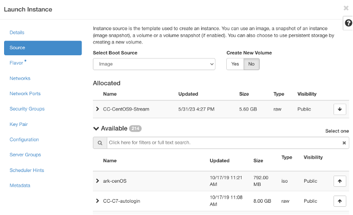
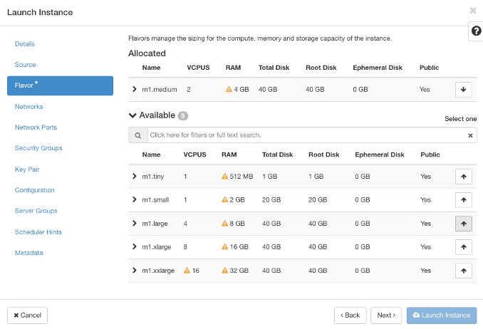
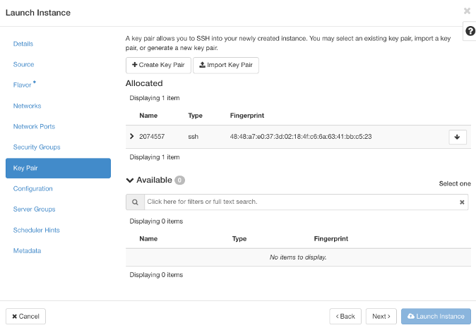
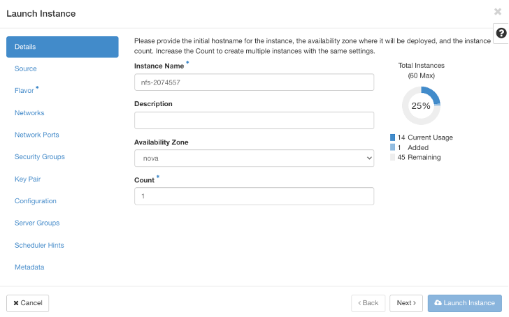
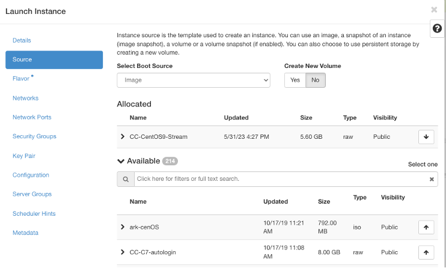
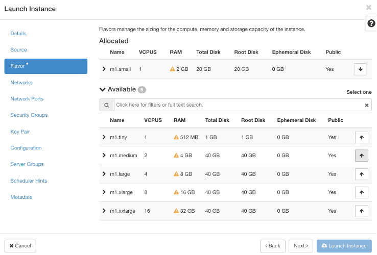
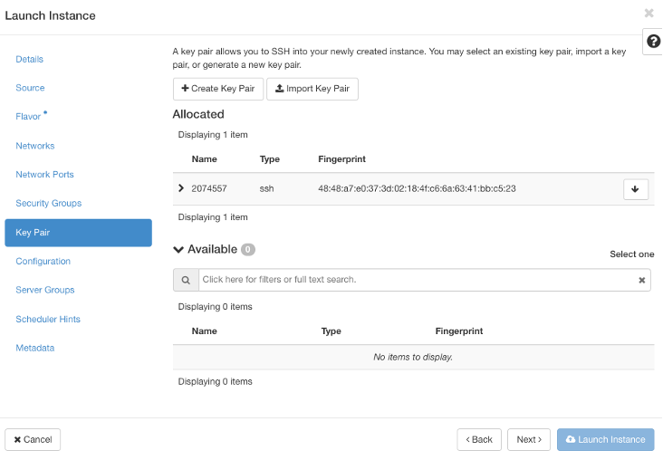
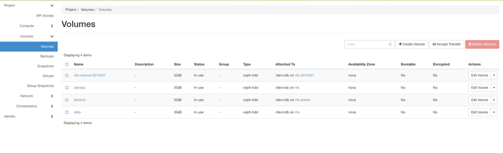

# MPI-ChameleonCloud-Cluster-Setup

**Setup and Configuration of a Virtual Machine Cluster to Run MPI Programs**

---

## Objective

This repository showcases the process of setting up a virtual machine (VM) cluster on Chameleon Cloud to execute MPI-based parallel programs. It includes detailed configurations for shared storage using NFS, installation of MPICH, and execution of a distributed "Hello World" program.

---

## Features

- **Virtual Machine Deployment and Configuration**:  
  Set up a cluster with multiple VMs for parallel computing.

- **NFS Server Setup**:  
  Configure a shared storage system for seamless data sharing between nodes.

- **MPICH Installation**:  
  Install and configure the MPICH library for running MPI programs.

- **Distributed Program Execution**:  
  Run and verify a parallel "Hello World" program across the cluster.
  
---

## Set Up Environment

- **Create 3 Virtual Machines using CentOS Stream9**:  
  These virtual machines are configured as a cluster to enable distributed computing. Access to the cluster is secured using an SSH key pair, consisting of a public key (stored on the virtual machines) and a private key.

   

   

   

   

- **Create NFS Server**:  
  Create an NFS server with a 5GB volume. Attach the volume to the NFS server to enable shared storage for the cluster.

   

   

   

   

   

- **Modify /etc/hosts**:  
  Configuring the /etc/hosts file on each virtual machine to enable hostname resolution within cluster.By editing this file, we ensure that all the nodes in the cluster can communicate using human-readable hostnames instead of hard-to-remember IP addresses.
  
