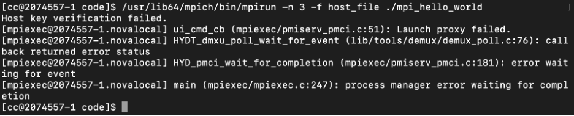

# MPICH-ChameleonCloud-Cluster-Setup

**Setup and Configuration of a Virtual Machine Cluster to Run MPI Programs**

---

## Objective

This repository showcases the process of setting up a virtual machine (VM) cluster on Chameleon Cloud to execute MPI-based parallel programs. It includes detailed configurations for shared storage using NFS, installation of MPICH, and execution of a distributed "Hello World" program.

---

## Features

- **Virtual Machine Deployment and Configuration**:  
  Set up a cluster with multiple VMs for parallel computing.

- **NFS Server Setup**:  
  Configure a shared storage system for seamless data sharing between nodes.

- **MPICH Installation**:  
  Install and configure the MPICH library for running MPI programs.

- **Distributed Program Execution**:  
  Run and verify a parallel "Hello World" program across the cluster.

---

## Set Up Environment

### **Create 3 Virtual Machines using CentOS Stream9**  
These virtual machines are configured as a cluster to enable distributed computing. Access to the cluster is secured using an SSH key pair, consisting of a public key (stored on the virtual machines) and a private key.

<br>
<br>
<br>
<br>

---

### **Create NFS Server**  
Create an NFS server with a 5GB volume. Attach the volume to the NFS server to enable shared storage for the cluster.

<br>
<br>
<br>
<br>
<br>

---

### **Modify `/etc/hosts`**  
Configuring the `/etc/hosts` file on each virtual machine enables hostname resolution within the cluster. By editing this file, we ensure that all the nodes in the cluster can communicate using human-readable hostnames instead of hard-to-remember IP addresses.

Example `/etc/hosts` configuration:

```bash
[cc@2074557-3 ~]$ cat /etc/hosts
127.0.0.1   localhost localhost.localdomain localhost4 localhost4.localdomain4
::1         localhost localhost.localdomain localhost6 localhost6.localdomain6
10.56.1.56  2074557-1.novalocal
10.56.3.137 2074557-2.novalocal
10.56.1.160 2074557-3.novalocal
10.56.0.214 nfs-2074557.novalocal
[cc@2074557-3 ~]$
```
---

### **Install MPICH**

- **Install MPICH libraries on all VMs**:
  This library will allow VMs to communicate in parallel and run MPI jobs across multiple machines. 
- **Create Data Directory**:
  We create directory on each VM to prepare it for sharing. In the further step, we will export the /data directory from the NFS server, so that this directory will be available for other VMs(clients) to access.

  Example configuration:

```bash
[cc@2074557-3 ~]$ sudo yum -y install mpich mpich-devel
Last metadata expiration check: 2:52:17 ago on Fri 06 Dec 2024 09:20:33 PM EST.
Package mpich-4.1.1-1.el9.x86_64 is already installed.
Package mpich-devel-4.1.1-1.el9.x86_64 is already installed.
Dependencies resolved.
Nothing to do.
Complete!
[cc@2074557-3 ~]$ mkdir /data
mkdir: cannot create directory ‘/data’: File exists
[cc@2074557-3 ~]$
```
---

### **Create and Format the Attached Volume On NFS Server**
- **For NFS server, we can see /dev/vdb directory because we attached the volume 5 Gib and attached to it on chameleon cloud. This is an empty, unformatted disk so we need to partition it and format it with file system.**
- **Use parted command to start managing disk partition on /dev/vdb**
- **Set up partition table by running mklabel gpt. This command will initialize new attached volume with GPT (Globally Unique Identifiers Partition Tables) partition table.**
- **After creating the GPT label, we run mkpart command to create new partition on the disk.**
- **We specify 1m mean starts at 1MB from the beginning of the disk and 100% means the partition will take up the entire disk.**
- **After we quit the process, now we have a new partition on the /dev/vdb volume. We do step above to prepare the disk for usage by operating system.**

   Example configuration:

  <br>
  
- **Then we make the disk to be file system by using mkfs.ex4 /dev/vdb 1. We run mkfs.ext4 to create an ext4 file system on a partition, allowing it to store files and data.**
- **Now, we have /dev/vdb1 represents the first partition on the /dev/vdb disk, and we also have /dev/vdb1 represents the first partition which we used partition tool (parted) on the /dev/vdb disk.**
- **Next step, we edit fstab file (file system table) to make sure that directory /dev/vdb1 will be mounted at boot time to /data directory. Then we run command mount -a to mount all file systems in the /etc/fstab file.**

  Example configuration:
  
  <br>

After that, we specify which directories we want to share to the VMs and what permissions they have by editing the `/etc/exports` file as the picture belows:
- `/data`: the directory on the NFS server that will be shared with the client.
- **• IP address**: the IP address of the client that can access the `/data` directory.
- **• rw**: the permission that clients can do, which is read and write only.
- **• Sync**: Data written to the NFS server is immediately written to disk (`/dev/dvb1`).
- **• no_root_squash**: allowing the root user on the client machine to act as the root user on the NFS server.

  Example configuration:
  
  <br>

Then we start NFS service by using command systemctl enable –now rpcbind nfs-server.

  <br>
  
Next, we edit /etc/fstab to specify that the NFS share should be mounted on boot automatically. Client machine will mounts the NFS shared directory every time it starts up.

  <br>
  
Testing the cluster work by building mpi_hello_world.c in directory /data/code.
Create host_file that contain list of hostnames of the machines that will run the MPI processes.

  <br>
  
To ensure that all VMs can communicate with each other, we need to establish trust between the VMs by using SSH. This is done by SSH from the VM where we intend to run the program to all other VMs and accepting the SSH keys. This step is essential because it allows passwordless SSH connections, which are required for the MPI processes to run across the VMs without interruption.

  <br>
  <br>
  <br>
  <br>

After that we can build the program and run it.

  <br>

  ---


  


  


